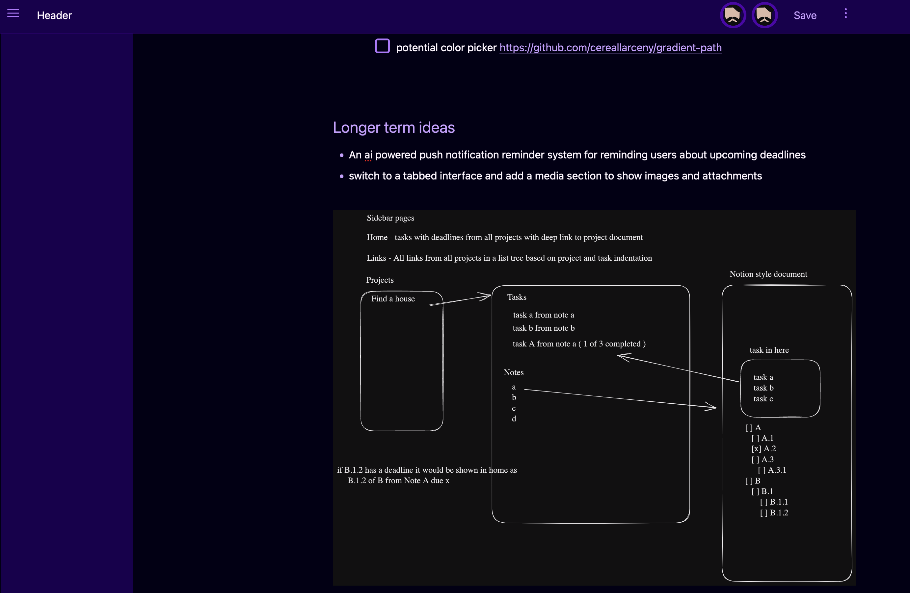

Keep track of your notes and tasks, and keep your freedom

- [Motivation](#motivation)
- [Why another Notes and Tasks App](#why-another-notes-and-tasks-app)
- [Screenshots](#screenshots)

## Snapshot of current roadmap (in-app)

## Motivation
There are a lot of other things out there, but all of them have drawbacks, here are a few I've tried

- Todoist -- everything is slowly becoming paid and they own all your data?
- Notion -- man that privacy policy is scary
- Oblivion -- another propetairy thing? paid sync?

I realized that there are a couple of things I want out of an appplication like this, and there are a couple of non-negotiables

## Why another Notes and Tasks App
- non-proprietary -- this is my data, fuck your terms of service
- mobile and desktop
- offline first -- I need my notes, even if I'm in the woods
- collaborative editing
- sharing is a must
- no single point of failure
- I need all this stuff to sync between my devices too

Realizing that this didn't exist, and all of the times in my past that I have needed this application, I realized I was done waiting for someone else to buid it.

So, how do I hope to achieve all of this?
- non-proprietary -- easy -- AGPL 3 tried and true
- mobile and desktop -- a pwa seems like common sense
- offline first -- service workers and indexedDb with eager caching
- collaborative editing - yjs and webrtc
- sharing - a user model with invite links
- no single point of failure - (plans to implement ActivityPub)
- sync - currently pocketbase subscriptions and eager caching

## Screenshots
An assortment of desktop and mobile screenshots from the res folder

Collaboration

Quick Actions

Image Attachments

Rich Editing
